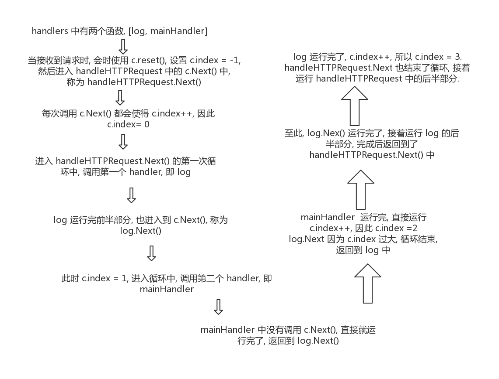

## 简介

Gin 源码解读, 基于 [v1.5.0 ](https://github.com/gin-gonic/gin/tree/v1.5.0) 版本.

## 流程总览

官方文档上, 一个入门例子如下:

```go
package main

import "github.com/gin-gonic/gin"

func main() {
	r := gin.Default()
	r.GET("/ping", func(c *gin.Context) {
		c.JSON(200, gin.H{
			"message": "pong",
		})
	})
	r.Run() // 监听并在 0.0.0.0:8080 上启动服务
}
```

看上去非常简单, 首先进行初始化 `gin.Default()`, 接着定义了一个叫做 `/ping` 的路由, 最后直接启动了 `r.Run()`.

## 初始化

首先, 深入查看下 `gin.Default()` 的过程:

```go
// Default returns an Engine instance with the Logger and Recovery middleware already attached.
func Default() *Engine {
	debugPrintWARNINGDefault()
	engine := New()
	engine.Use(Logger(), Recovery())
	return engine
}
```

配合注释, 我们就明白了 `Default` 的主要功能是初始化 `Engine`, 然后加载了两个中间件, 用于日志记录和恢复.

而 `Engine` 实际上是一个结构体, 也是 Gin 框架的核心, 看一下它的定义.

```go
// Engine is the framework's instance, it contains the muxer, middleware and configuration settings.
// Create an instance of Engine, by using New() or Default()
type Engine struct {
	RouterGroup

	// Enables automatic redirection if the current route can't be matched but a
	// handler for the path with (without) the trailing slash exists.
	// For example if /foo/ is requested but a route only exists for /foo, the
	// client is redirected to /foo with http status code 301 for GET requests
	// and 307 for all other request methods.
	RedirectTrailingSlash bool

	// If enabled, the router tries to fix the current request path, if no
	// handle is registered for it.
	// First superfluous path elements like ../ or // are removed.
	// Afterwards the router does a case-insensitive lookup of the cleaned path.
	// If a handle can be found for this route, the router makes a redirection
	// to the corrected path with status code 301 for GET requests and 307 for
	// all other request methods.
	// For example /FOO and /..//Foo could be redirected to /foo.
	// RedirectTrailingSlash is independent of this option.
	RedirectFixedPath bool

	// If enabled, the router checks if another method is allowed for the
	// current route, if the current request can not be routed.
	// If this is the case, the request is answered with 'Method Not Allowed'
	// and HTTP status code 405.
	// If no other Method is allowed, the request is delegated to the NotFound
	// handler.
	HandleMethodNotAllowed bool
	ForwardedByClientIP    bool

	// #726 #755 If enabled, it will thrust some headers starting with
	// 'X-AppEngine...' for better integration with that PaaS.
	AppEngine bool

	// If enabled, the url.RawPath will be used to find parameters.
	UseRawPath bool

	// If true, the path value will be unescaped.
	// If UseRawPath is false (by default), the UnescapePathValues effectively is true,
	// as url.Path gonna be used, which is already unescaped.
	UnescapePathValues bool

	// Value of 'maxMemory' param that is given to http.Request's ParseMultipartForm
	// method call.
	MaxMultipartMemory int64

	delims           render.Delims
	secureJsonPrefix string
	HTMLRender       render.HTMLRender
	FuncMap          template.FuncMap
	allNoRoute       HandlersChain
	allNoMethod      HandlersChain
	noRoute          HandlersChain
	noMethod         HandlersChain
	pool             sync.Pool
	trees            methodTrees
}
```

注释里写到 `Engine` 的初始化有两种方式, `Default()` 已经看过了, 看一下 `New()`:

```go
// New returns a new blank Engine instance without any middleware attached.
// By default the configuration is:
// - RedirectTrailingSlash:  true
// - RedirectFixedPath:      false
// - HandleMethodNotAllowed: false
// - ForwardedByClientIP:    true
// - UseRawPath:             false
// - UnescapePathValues:     true
func New() *Engine {
	debugPrintWARNINGNew()
	engine := &Engine{
		RouterGroup: RouterGroup{
			Handlers: nil,
			basePath: "/",
			root:     true,
		},
		FuncMap:                template.FuncMap{},
		RedirectTrailingSlash:  true,
		RedirectFixedPath:      false,
		HandleMethodNotAllowed: false,
		ForwardedByClientIP:    true,
		AppEngine:              defaultAppEngine,
		UseRawPath:             false,
		UnescapePathValues:     true,
		MaxMultipartMemory:     defaultMultipartMemory,
		trees:                  make(methodTrees, 0, 9),
		delims:                 render.Delims{Left: "{{", Right: "}}"},
		secureJsonPrefix:       "while(1);",
	}
	engine.RouterGroup.engine = engine
	engine.pool.New = func() interface{} {
		return engine.allocateContext()
	}
	return engine
}
```

再看一下, 添加中间件的过程.

```go
// Use attaches a global middleware to the router. ie. the middleware attached though Use() will be
// included in the handlers chain for every single request. Even 404, 405, static files...
// For example, this is the right place for a logger or error management middleware.
func (engine *Engine) Use(middleware ...HandlerFunc) IRoutes {
	engine.RouterGroup.Use(middleware...)
	engine.rebuild404Handlers()
	engine.rebuild405Handlers()
	return engine
}
```

添加中间件, 实际上是在 `RouterGroup` 上注册, 那么这 `RouterGroup` 又是什么呢?

```go
// RouterGroup is used internally to configure router, a RouterGroup is associated with
// a prefix and an array of handlers (middleware).
type RouterGroup struct {
	Handlers HandlersChain
	basePath string
	engine   *Engine
	root     bool
}
```

原来, `RouterGroup` 是用来配置路由的, 内部包含一个路由路径 `basePath` 和中间件数组 `Handlers`.
所以, 添加中间件只是在 `Handlers` 中新加一个元素:

```go
// Use adds middleware to the group, see example code in GitHub.
func (group *RouterGroup) Use(middleware ...HandlerFunc) IRoutes {
	group.Handlers = append(group.Handlers, middleware...)
	return group.returnObj()
}

func (group *RouterGroup) returnObj() IRoutes {
	if group.root {
		return group.engine
	}
	return group
}
```

初始化的过程大体上就是如此.

## 注册 handler

web 服务器最主要的当然是定义路由和处理函数了.

```go
r.GET("/ping", func(c *gin.Context) {
  c.JSON(200, gin.H{
    "message": "pong",
  })
})
```

在前面, 我们已经看过了 `Engine` 的定义, 注意看以下定义:

```go
type Engine struct {
  RouterGroup
```

这显示了 `Engine` 的内部使用了 `RouterGroup`, 所以其实上各种 HTTP 方法都是注册在 `RouterGroup` 上的. 具体看一下 `GET` 方法:

```go
// GET is a shortcut for router.Handle("GET", path, handle).
func (group *RouterGroup) GET(relativePath string, handlers ...HandlerFunc) IRoutes {
	return group.handle("GET", relativePath, handlers)
}
```

通过注释和代码, 我们可以知道, `GET` 只是一个快捷方式, 其实所有的 HTTP 方法注册都是由 `router.Handle` 处理的.

```go
func (group *RouterGroup) handle(httpMethod, relativePath string, handlers HandlersChain) IRoutes {
	absolutePath := group.calculateAbsolutePath(relativePath)
	handlers = group.combineHandlers(handlers)
	group.engine.addRoute(httpMethod, absolutePath, handlers)
	return group.returnObj()
}
```

`handle` 的核心语句是 `group.engine.addRoute(httpMethod, absolutePath, handlers)`.

先看一下 `combineHandlers`, 可以发现原来 handlers 是有限制的, 不能超过 63 个.
突然觉得 Golang 中组合 slice 是有点蛋疼, 居然要写三行.

```go
func (group *RouterGroup) combineHandlers(handlers HandlersChain) HandlersChain {
	finalSize := len(group.Handlers) + len(handlers)
	if finalSize >= int(abortIndex) {
		panic("too many handlers")
	}
	mergedHandlers := make(HandlersChain, finalSize)
	copy(mergedHandlers, group.Handlers)
	copy(mergedHandlers[len(group.Handlers):], handlers)
	return mergedHandlers
}
```

具体看一下 `addRoute` 有什么操作.

```go
func (engine *Engine) addRoute(method, path string, handlers HandlersChain) {
	assert1(path[0] == '/', "path must begin with '/'")
	assert1(method != "", "HTTP method can not be empty")
	assert1(len(handlers) > 0, "there must be at least one handler")

	debugPrintRoute(method, path, handlers)
	root := engine.trees.get(method)
	if root == nil {
		root = new(node)
		root.fullPath = "/"
		engine.trees = append(engine.trees, methodTree{method: method, root: root})
	}
	root.addRoute(path, handlers)
}
```

略过前面的判断之后, 可以看到核心是操作 `engine.trees`. 这用到了 [httprouter](https://github.com/julienschmidt/httprouter).
`root.addRoute(path, handlers)` 的内容有点多, 就不展开了.

总之, 到这里, 路由已经注册好了.

## 运行

最后, 看一下 `r.Run()` 部分.

```go
// Run attaches the router to a http.Server and starts listening and serving HTTP requests.
// It is a shortcut for http.ListenAndServe(addr, router)
// Note: this method will block the calling goroutine indefinitely unless an error happens.
func (engine *Engine) Run(addr ...string) (err error) {
	defer func() { debugPrintError(err) }()

	address := resolveAddress(addr)
	debugPrint("Listening and serving HTTP on %s\n", address)
	err = http.ListenAndServe(address, engine)
	return
}
```

这是一个阻塞的方法, 除非发生错误. 内部使用 `net/http` 包的 `ListenAndServe` 函数.

## 接收请求

上面我们已经看到运行是通过 `http.ListenAndServe(address, engine)` 实现的,
这是内置的 `net/http` 包的内容, 看一下具体的定义:

```go
func ListenAndServe(addr string, handler Handler) error
```

第二个参数的类型是 `Handler`, 一猜就知道应该是接口类型, 看一下具体要实现什么.

```go
type Handler interface {
  ServeHTTP(ResponseWriter, *Request)
}
```

看一下 `Engine` 是如何实现 `ServeHTTP` 方法的.

```go
// ServeHTTP conforms to the http.Handler interface.
func (engine *Engine) ServeHTTP(w http.ResponseWriter, req *http.Request) {
	c := engine.pool.Get().(*Context)
	c.writermem.reset(w)
	c.Request = req
	c.reset()

	engine.handleHTTPRequest(c)

	engine.pool.Put(c)
}
```

主要看一下 `engine.handleHTTPRequest(c)`, 这用于处理 HTTP 请求.

```go
func (engine *Engine) handleHTTPRequest(c *Context) {
	httpMethod := c.Request.Method
	rPath := c.Request.URL.Path
	unescape := false
	if engine.UseRawPath && len(c.Request.URL.RawPath) > 0 {
		rPath = c.Request.URL.RawPath
		unescape = engine.UnescapePathValues
	}
	rPath = cleanPath(rPath)

	// Find root of the tree for the given HTTP method
	t := engine.trees
	for i, tl := 0, len(t); i < tl; i++ {
		if t[i].method != httpMethod {
			continue
		}
		root := t[i].root
		// Find route in tree
		value := root.getValue(rPath, c.Params, unescape)
		if value.handlers != nil {
			c.handlers = value.handlers
			c.Params = value.params
			c.fullPath = value.fullPath
			c.Next()
			c.writermem.WriteHeaderNow()
			return
		}
		if httpMethod != "CONNECT" && rPath != "/" {
			if value.tsr && engine.RedirectTrailingSlash {
				redirectTrailingSlash(c)
				return
			}
			if engine.RedirectFixedPath && redirectFixedPath(c, root, engine.RedirectFixedPath) {
				return
			}
		}
		break
	}

	if engine.HandleMethodNotAllowed {
		for _, tree := range engine.trees {
			if tree.method == httpMethod {
				continue
			}
			if value := tree.root.getValue(rPath, nil, unescape); value.handlers != nil {
				c.handlers = engine.allNoMethod
				serveError(c, http.StatusMethodNotAllowed, default405Body)
				return
			}
		}
	}
	c.handlers = engine.allNoRoute
	serveError(c, http.StatusNotFound, default404Body)
}
```

代码有点长, 不过有两句注释可以帮我们快速理解逻辑, 主要根据 HTTP 方法和路径从 `engine.trees` 找到
对应的 handlers, 当能找到时:

```go
if value.handlers != nil {
  c.handlers = value.handlers
  c.Params = value.params
  c.fullPath = value.fullPath
  c.Next()
  c.writermem.WriteHeaderNow()
  return
}
```

重点关注下 `c.Next()`:

```go
// Next should be used only inside middleware.
// It executes the pending handlers in the chain inside the calling handler.
// See example in GitHub.
func (c *Context) Next() {
	c.index++
	for c.index < int8(len(c.handlers)) {
		c.handlers[c.index](c)
		c.index++
	}
}
```

由此, 就执行 Context 中的 handlers. 注意到, handlers 中包括了中间件和主处理函数,
因此就完成了路由的处理.

当然, 也有找不到对应的路由的时候, 这可能有多种原因, 比如 HTTP 方法不存在, 或者是路径不存在.

## 中间件原理

调用 Next() 的过程中涉及到了中间件的原理, 下面具体讲一讲.

先看一下如何定义并添加中间件, 来自官方文档:

```go
func Logger() gin.HandlerFunc {
	return func(c *gin.Context) {
		t := time.Now()

		// Set example variable
		c.Set("example", "12345")

		// before request

		c.Next()

		// after request
		latency := time.Since(t)
		log.Print(latency)

		// access the status we are sending
		status := c.Writer.Status()
		log.Println(status)
	}
}

func main() {
	r := gin.New()
	r.Use(Logger())

	r.GET("/test", func(c *gin.Context) {
		example := c.MustGet("example").(string)

		// it would print: "12345"
		log.Println(example)
	})

	// Listen and serve on 0.0.0.0:8080
	r.Run(":8080")
}
```

从上面的例子中可以看出, 定义中间件和定义主处理函数没什么区别, 方法定义都是 `gin.HandlerFunc`:

```go
type HandlerFunc func(*Context)
```

中间件中也调用了 `c.Next()`, 划分了请求的过程, `c.Next()` 运行前是请求前(before request), 运行后是请求后(after request).



从上面的流程图中假设注册两个处理函数, 第一个是 log 中间件, 用于日志记录, 另一个是该路径的主处理函数.
当接收到请求时, 进入很多个 Next 中, 这是因为中间件可能也会调用 `c.Next()`. 可以将 `c.Next()`
理解为控制流转移, 每当运行 `c.Next()`, 实际上是运行下一个 handler. 有点类似递归时的调用栈.

## 总结

Gin 的基本流程就是这样的, 粗看代码, 觉得还是挺清晰的. 更多内容还有待挖掘.
