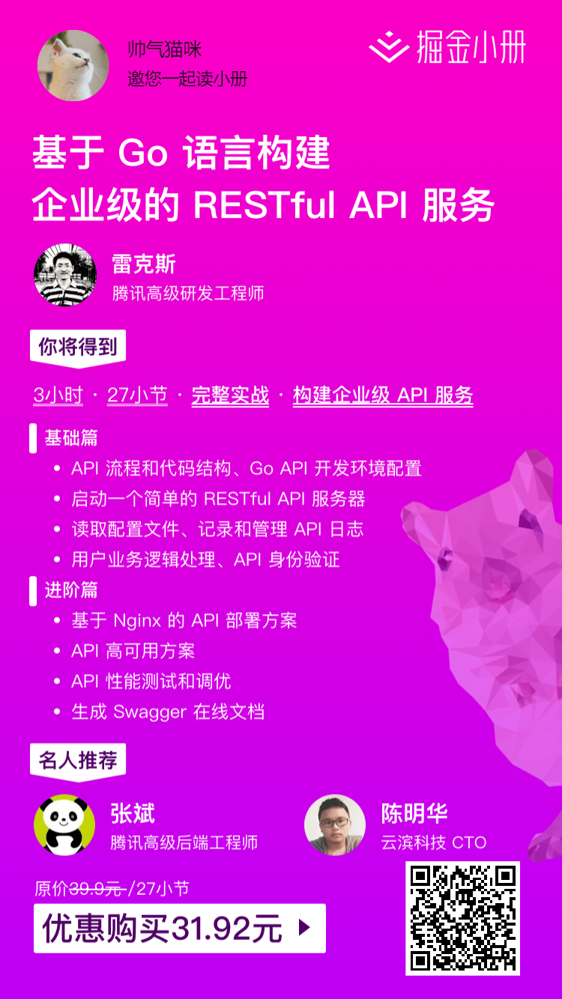

<!-- TOC -->

- [简介](#简介)
- [创建一个项目](#创建一个项目)
- [启动一个简单的服务器](#启动一个简单的服务器)
- [一点感受](#一点感受)
- [当前部分的代码](#当前部分的代码)
- [资瓷一下](#资瓷一下)

<!-- /TOC -->

## 简介

这可能是接下来一系列的文章的开始.

使用 Gin 创建一个 web 项目.

主要参考的是掘金小册里的 [基于 Go 语言构建企业级的 RESTful API 服务](https://juejin.im/book/5b0778756fb9a07aa632301e).

通过学习掘金小册, 并加上自己的实践, 完成一个完整的 Go Web 项目.

## 创建一个项目

新建一个项目, 并使用 go mod 初始化.

```bash
go mod init tzh.com/web
```

因为这个项目不会发布到其他地方, 也不会作为依赖被使用, 所以 **模块路径** 是随意选择的.

添加对 Gin 的依赖.

```bash
go get -u github.com/gin-gonic/gin
```

## 启动一个简单的服务器

第一部分是创建一个简单的服务器, 主文件如下:

```go
package main

import (
	"log"
	"net/http"

	"github.com/gin-gonic/gin"
	"tzh.com/web/handler/check"
	"tzh.com/web/router"
)

func main() {
	// 初始化空的服务器
	app := gin.New()
	// 保存中间件
	middlewares := []gin.HandlerFunc{}

	// 路由
	router.Load(
		app,
		middlewares...,
	)

	go func() {
		if err := check.PingServer(); err != nil {
			log.Fatal("服务器没有响应", err)
		}
		log.Printf("服务器正常启动")
	}()

	log.Printf("启动服务器在 http address: %s", ":8080")
	log.Printf(http.ListenAndServe(":8080", app).Error())
}

```

初始化了 Gin, 主要分为两步.

第一步运行了 `router.Load` 函数, 里面初始化了一些中间件, 以及一些检查类的 API.

第二步通过一个 goroutine 检查了服务器是否启动成功,
其实我觉得这里可以加一个循环, 定时检查服务器状态.

当前定义的中间件, 主要是设置 Headers 的, 这个就要熟不熟悉常见的 Headers,
这部分我不太熟悉, 以前主要是靠框架自动设置的.

Options 还是知道的, 添加跨域支持. 但对安全设置`middleware.Secure()`, 真的是没有研究.

```go
// 载入中间件
func Load(g *gin.Engine, mw ...gin.HandlerFunc) *gin.Engine {
	g.Use(gin.Logger())
	g.Use(gin.Recovery())
	g.Use(middleware.NoCache())
	g.Use(middleware.Options())
	g.Use(middleware.Secure())
	g.Use(mw...)

	g.NoRoute(func(ctx *gin.Context) {
		ctx.String(http.StatusNotFound, "incorrect api router")
	})

	checkRoute := g.Group("/check")
	{
		checkRoute.GET("/health", check.HealthCheck)
		checkRoute.GET("/disk", check.DiskCheck)
		checkRoute.GET("/cpu", check.CPUCheck)
		checkRoute.GET("/memory", check.MemoryCheck)
	}

	return g

}
```

接着设置了对 404 的响应.

gin.Group 是个好东西, 用于创建必要前缀, 或者分组都很有用,
官方文档里的例子演示了如何用作 api 版本的区分.

这里组织了一些检查服务器状态的 API, 主要使用 gopsutil 模块获取.

当前的内容就分析到这里, 代码见下面.

## 一点感受

差不多是第一次写一个完整的 Go 项目, 不得不说, 折腾编辑器就折腾好久了.

一开始总是有很多的不习惯和陌生, 还是要多多接触.

Go 的模块现在还不是很成熟, gopls 的提示也不是很完美, 感觉脱离了编辑器就不会写代码了.

## 当前部分的代码

作为版本 [0.1.0](https://github.com/zhenhua32/go_web/tree/0.1.0)

## 资瓷一下

虽然不是我写的, 大家都能优惠, 也支持一下原作者.



