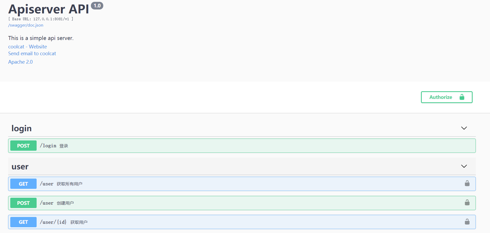

<!-- TOC -->

- [简介](#简介)
- [swagger 起步](#swagger-起步)
- [编写文档](#编写文档)
- [运行](#运行)
- [总结](#总结)
- [当前部分的代码](#当前部分的代码)

<!-- /TOC -->

## 简介

对于 API 服务来说, 文档是必不可少的.

然而文档却挺烦人的, 尤其是同步更新的问题. 如果选择手写文档, 经常会忘了更新文档;
或者处于高速开发的前期, 来不及更新文档.

现在更推崇的方式是`文档即注释`, 就是将文档作为注释, 和代码同步更新,
使用自动生成文档的方式实时更新.

另一种概念是`文档即测试`, 让文档不但能看, 也能用, 这对于 API 文档来说,
是一个巨大的便利. 有了它, 再也不用一边看文档, 一边开着 Postman 实验了.

这就是 [swagger](https://swagger.io/).

## swagger 起步

swagger 提供了很多工具用于创建 API 文档, 尤其是创建了 RESTful APIs 标准.

这个 RESTful APIs 标准又称为 `OpenAPI Specification`, 目前有两个规范,
`2.0` 和 `3.0`. 大部分的实现都是基于 `2.0` 的.

这个项目使用的也是 `2.0` 规范.

安装 swag 工具, 也可以直接下载预编译的二进制文件.

```bash
go get -u github.com/swaggo/swag/cmd/swag
```

在项目根目录下运行 `swag init`, 应该会创建 docs 目录.

```bash
swag init
```

安装 `swag-gin`.

```bash
go get -u github.com/swaggo/gin-swagger
go get -u github.com/swaggo/files
```

到这里, 依赖已经安装完成了, 剩下的就是编写文档了.

## 编写文档

毕竟是一种规范, 还是要学习它的使用方式的, 如果有兴趣, 可以看
[原始的规范](https://github.com/OAI/OpenAPI-Specification).

这里看 swag 库的文档就行了,
[Declarative Comments Format](https://github.com/swaggo/swag#declarative-comments-format).

使用的是声明式的符号记法, 主要格式是 `@key value`, 即键值对,
最后解析后生成的其实是一整个 json 文件.

编写 `main` 函数的注释, 定义了 API 的通用信息.

```go
// @title Apiserver API
// @version 1.0
// @description This is a simple api server.

// @contact.name coolcat
// @contact.url http://coolcat.io/support
// @contact.email help@coolcat.io

// @license.name Apache 2.0
// @license.url http://www.apache.org/licenses/LICENSE-2.0.html

// @host 127.0.0.1:8081
// @BasePath /v1

// @securityDefinitions.apikey ApiKeyAuth
// @in header
// @name Authorization
func main() {
	cmd.Execute()
}
```

在上面的注释里, 主要有四部分, 分别定义了:

- 标题, 版本号, 描述
- 联系信息
- license
- 安全定义

更新 `router.go`, 将 swagger 和 gin 结合:

```go
import {
  swaggerFiles "github.com/swaggo/files"
  ginSwagger "github.com/swaggo/gin-swagger"
    // docs is generated by Swag CLI, you have to import it.
  _ "tzh.com/web/docs"
}

func Load(g *gin.Engine, mw ...gin.HandlerFunc) *gin.Engine {
  ...
  // swagger 文档
	// The url pointing to API definition
	// /swagger/index.html
	url := ginSwagger.URL("/swagger/doc.json")
	g.GET("/swagger/*any", ginSwagger.WrapHandler(swaggerFiles.Handler, url))
  ...
}
```

剩下的就是编写每个接口的文档了, 举个例子, login 接口的文档如下:

```go
// @Summary 登录
// @Description 登录账户, 获取 token
// @Tags login
// @Accept  json
// @Produce  json
// @Param body body model.UserModel true "User login""
// @Success 200 {object} model.Token "{"code":0,"message":"OK","data":{"token":"name"}}"
// @Router /login [post]
func Login(ctx *gin.Context) {
```

这里定义了接口的基本属性, 包括路径, 请求类型, 成功时的输出, 输出格式等.

```go
// @Summary 获取用户
// @Description 从数据库中获取用户信息
// @Tags user
// @Accept  json
// @Produce  json
// @Security ApiKeyAuth
// @Param id path uint64 true "user id in database"
// @Success 200 {object} model.UserModel "{"code":0,"message":"OK","data": {}}"
// @Router /user/{id} [get]
func Get(ctx *gin.Context) {
```

get 接口比上面的 login 接口多了一个参数 `@Security ApiKeyAuth`, 用于定义认证方式.
已经在 `main` 函数的注释中定义了认证方式 `ApiKeyAuth` 了, 这里就可以直接指定了.

每次更新完文档之后, 都需要运行 `swag init` 更新 docs 目录.

启动服务器之后, 就可以在 `/swagger/index.html` 上访问 API 文档了.

更多的文档注释, 可以在源代码中查看.

## 运行

文档编写完成之后, 都需要运行 `swag init` 更新, 可以将这个步骤定义在 Makefile 文件中.

```Makefile
build: updoc
	go build -ldflags ${ldflags} ./
run: updoc
	go run -ldflags ${ldflags} ./
docker: updoc
	go run -ldflags ${ldflags} ./ -c ./conf/config_docker.yaml
updoc:
	go mod download
	go get -u github.com/swaggo/swag/cmd/swag
	swag init
```

运行 `make run`, 然后就可以在浏览器中打开 `http://localhost:8081/swagger/index.html` 并查看文档了.
打开 `http://localhost:8081/swagger/doc.json` 可以查看生成的 json 文件,
使用这个 json 文件, 可以在其他的 swagger gui 中查看 API 文档.



## 总结

swagger 为文档的编写提供了极大的便利, 工具虽好, 更重要的是坚持.

## 当前部分的代码

作为版本 [v0.16.0](https://github.com/zhenhua32/go_web/tree/v0.16.0)
