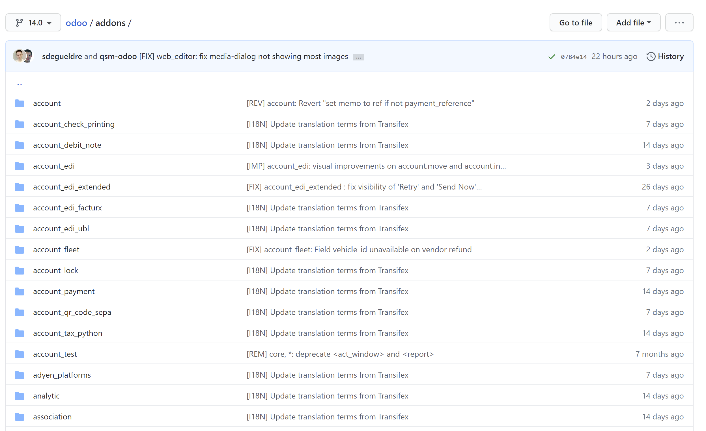
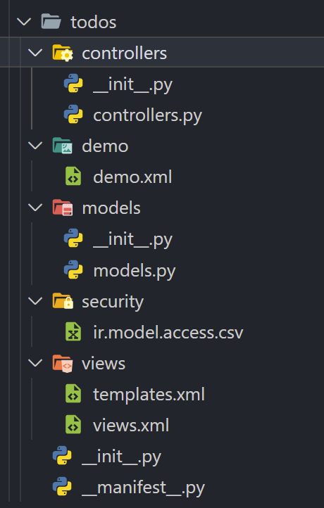
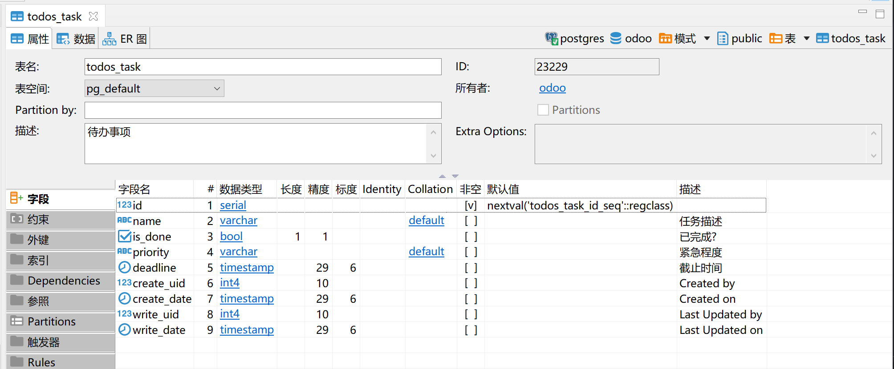
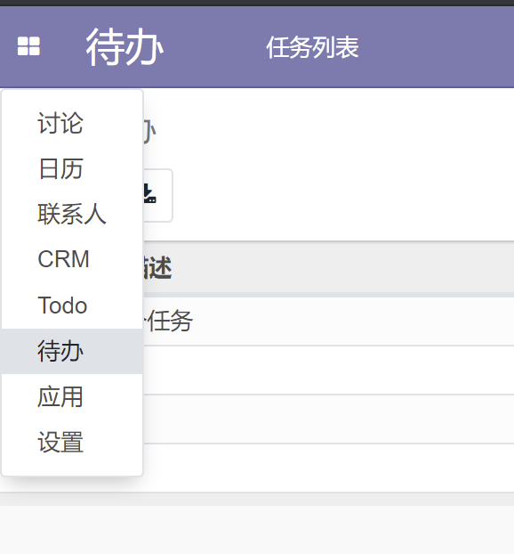
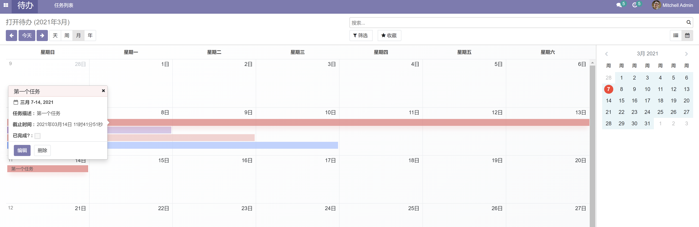
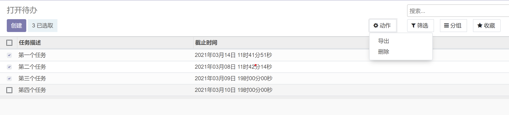
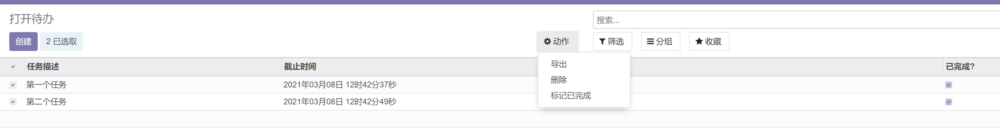

# 构建一个 TODO 应用

## 简介

> Odoo，是一套企业资源规划及客户关系管理系统。以 Python 语言开发，数据库采用开源的 PostgreSQL，系统以 GNU GPL 开源协议发布。
> 系统提供较灵活的模块架构，常用模块包括：采购管理、销售管理、库存管理、财务管理、货品管理、营销管理、客户关系管理、生产管理、人事管理及服务支持等等。
> => 维基百科

> doo 采用开源商业模式为核心运营，满足企业全方位的业务管理需求，多种部署方式可选，微服务应用模块，以用户为中心，可满足客户关系管理，
> 电子商务，库存管理，财务管理，PoS 系统管理，等现代化的企业管理需求。告别重复性的数据整合导出，一站式服务中小企业数字化升级，释放增长潜力。
> Odoo 的独特价值是非常容易使用和完全集成。。
> => 官网

## 目标

今天主要讲讲, 如何使用 odoo 构建一个新模块, 添加一个 TODO 应用.



如果看下 odoo 的源码, 可以发现大部分的内容都是 addons 目录下, 插件机制是 odoo 的重点, 基本上所有的功能都是通过模块扩展的.
比模块更高级的是应用, 应用和模块在代码上没什么区别, 只是在配置文件中改个 application 参数而已. 应用在概念上来说, 就是相比模块功能更全, 更成熟.

> Whether the module should be considered as a fully-fledged application (True) or is just a technical module (False) that provides some extra functionality to an existing application module.

直接开始吧, 新建模块走起.

## 初始化模块

`odoo-bin` 是 odoo 的启动脚本, 本质上是一个 python 文件, 可以直接当成命令行工具使用. 有个子命令 `scaffold` 可以用来生成模块的模板, 有两个参数, 分别是模块名和模块所在的目录.

docker 镜像中 `odoo-bin` 重命名成 `odoo` 了, 本质上一样的, 接下来就不区分这两个命令了.

```bash
odoo scaffold todos ./addons/
```

## 模块的基本结构



- controllers 控制层, 定义路由的地方
- demo 示例数据, odoo 新建数据库时选择了对应的选项后会加载 demo 数据
- models 定义模型的地方
- security 权限配置等
- views 定义视图的地方
- `__init__.py` 毕竟是个 python package
- `__manifest__.py` 定义配置选项的地方

从上面的目录结构中看, odoo 遵循的是 MVC 构架.

## 安装应用

启动 odoo 服务之前, 需要改下配置, 将刚才选择的插件目录添加到配置中.
修改下配置 `/etc/odoo/odoo.conf`:

```conf
addons_path = /mnt/extra-addons,/workspace/addons
```

```bash
/entrypoint.sh odoo
```

http://127.0.0.1:8070

使用上面的命令启动 odoo, 第一次进入网站的时候, 需要设置主密码和登录账号等.
一开始直接进入的是应用界面, 默认有个筛选项是应用, 清空筛选, 搜索 todos 模块.

TODO: 遇到了莫名的无法找到模块, 明明已经配置好 addons 路径了. 可能和 docker 容器有关.

## 定义模型

```python
from odoo import models, fields, api


class TodosTask(models.Model):
    # 定义模块名字
    _name = "todos.task"
    # 定义描述
    _description = "待办事项"

    # 定义字段
    name = fields.Char("任务描述")
    is_done = fields.Boolean("已完成?")
    priority = fields.Selection([("low", "低"), ("normal", "中"), ("high", "高")], default="normal", string="紧急程度")
    deadline = fields.Datetime("截止时间")

    # 计算字段
    is_expired = fields.Boolean("已过期", compute="_compute_is_expired")

    @api.depends("deadline", "is_done")
    def _compute_is_expired(self):
        for record in self:
            record.is_expired = False
            if record.deadline and not record.is_done:
                record.is_expired = record.deadline < fields.Datetime.now()
```

对于这个待办应用, 这里定义了四个主要的字段, 描述, 是否已完成, 优先级, 截止时间.
还有一个计算字段, 是否过期, 计算字段不存储在数据库中, 而是在获取数据后自动计算.
需要显式的定义依赖字段, 这里计算截止时间依赖其他字段, 需要知道截止时间和是否已完成.

```csv
id,name,model_id:id,group_id:id,perm_read,perm_write,perm_create,perm_unlink
access_todos_task,todos.task,model_todos_task,base.group_user,1,1,1,1
```

定义模型之后, 还需要定义模型的权限, 现在我们将所有权限都开放给用户.

更新模块的代码后, 要生效, 需要重启服务去页面上手动升级模块. 也可以使用命令行参数 `-u module_name`.

## 定义菜单

添加模型后, 对网页来说, 其实什么变化也没有. 但如果你看数据库的话, 可以发现的确添加了一个新表.



要显示模块的内容, 需要添加视图, 而视图之前必须先有菜单才能进入视图.

```xml
<odoo>
    <data>
        <!-- 定义一个动作, 打开 todos.task 的视图 -->
        <record model="ir.actions.act_window" id="action_todos_task">
            <field name="name">打开待办</field>
            <field name="res_model">todos.task</field>
            <field name="view_mode">tree,form</field>
            <field name="help" type="html">
                <p class="o_view_nocontent_smiling_face">添加一个新待办
                </p>
            </field>
        </record>

        <!-- 定义一个主菜单, 显示在左上角的菜单里 -->
        <menuitem name="待办" id="todos.menu_root"/>

        <!-- 定义主菜单下的二级菜单, 点击进入主菜单后, 在左上角菜单的右边, 如果关联了动作, 点击后就会触发动作 -->
        <menuitem name="任务列表" id="todos.menu_1" parent="todos.menu_root" action="action_todos_task"/>

    </data>
</odoo>
```

重启并升级应用后, 可以在左上角菜单中看到一个新选项 `待办`, 这就是刚添加的新菜单.



现在也可以操作下, 手动添加几个任务. 添加几个任务后, 会发现在任务列表上只能看到一个任务描述字段, 显示的信息太少了?

## 定义视图

添加完菜单中, 终于可以在网页上创建和编辑模型的实例了, 现在我们需要调整下模型的视图, 因为默认创建的视图不太符合我们的需求.
比如, 我们需要在列表页面上显示更多的字段, 不然一眼看过去信息太少了, 只能看到任务描述.

视图定义了模型记录的展示方式.

```xml
<odoo>
  <data>

    <record id="todos_task_calendar" model="ir.ui.view">
      <field name="name">todos.task.calendar</field>
      <field name="model">todos.task</field>
      <field name="arch" type="xml">
        <calendar string="name" date_start="create_date" date_stop="deadline" color="priority" mode="month">
          <field name="name"/>
          <field name="deadline"/>
          <field name="is_done"/>
        </calendar>
      </field>
    </record>

  </data>
</odoo>
```

这里添加了一个新的视图, 日历视图, 默认是按月展示任务.
日历视图需要开始时间 `date_start`, 这里使用了创建任务时自动添加的 `create_date` 字段.
也定义了一个结束时间 `date_stop`, 使用模型中定义的截止时间 `deadline`.

添加了一个新视图后, 也需要修改下前面定义的动作, 使得 view_mode 支持新类型的视图.

```xml
<field name="view_mode">tree,form,calendar</field>
```

重启并升级应用后, 就可以在任务列表的右上角发现切换视图的按钮, 切换到日历视图看一下效果.



## 添加动作

添加完新视图后, 再来看看原本的列表视图. 顺便也修改一下, 多展示点字段.

```xml
<record id="todos_task_tree" model="ir.ui.view">
    <field name="name">todos.task.tree</field>
    <field name="model">todos.task</field>
    <field name="arch" type="xml">
    <tree string="任务列表👻😻">
        <field name="name"/>
        <field name="deadline"/>
        <field name="is_done"/>
    </tree>
    </field>
</record>
```

重启并更新应用后, 就能看到更多内容了. 现在我们有个需求, 想要一次性将多个待办标记为已完成呢?

我们可以看到, 在列表视图的每一项前面都有一个勾选框, 还能发现一个叫做动作的按钮, 似乎是一个不错的位置, 可以在这里完成想要的内容.



前面介绍了动作, 那时的动作是用来打开一个新窗口的, 展示视图用的.
动作当然不止这一种, 另一个叫服务器动作的可以满足这个需求.

> The available actions are :
>
> - ‘Execute Python Code’: a block of python code that will be executed
> - ‘Create a new Record’: create a new record with new values
> - ‘Write on a Record’: update the values of a record
> - ‘Execute several actions’: define an action that triggers several other server actions

文档是介绍了服务器动作能完成的功能. 这次就要用到第一个功能, 执行 python 代码了.

说到底, 要批量标记为已完成, 是一件比较简单的事情, 主要还是来看看在如何用服务器动作来实现.

```xml
<odoo>
    <data>
        <!-- 定义一个服务动作 -->
        <record model="ir.actions.server" id="action_todos_mark_done">
            <field name="name">标记已完成</field>
            <field name="model_id" ref="model_todos_task"/>
            <field name="binding_model_id" ref="model_todos_task"/>
            <field name="state">code</field>
            <field name="code">
            records.write({'is_done': True})
            </field>
        </record>
    </data>
</odoo>
```

一个服务动作是 `ir.actions.server` 的实例, 然后指定 `state` 为 `code` 类型, 就可以在 code 字段中添加 python 代码了.
这里用到了一些上下文变量, 比如 `records` 就是动作触发时选择的待办列表.



TODO: 重启并升级后会报错, 需要将 mail 添加到依赖中, 不知详细信息.

重启并升级后, 就可以看到新添加的动作选项了.

## 定义接口

前面已经讲过了 MVC 中的模型和视图了, 最后看一看控制器层.

```python
from odoo import http


class Todos(http.Controller):
    @http.route('/todos/todos/', auth='public')
    def index(self, **kw):
        return "Hello, world"
```

定义一个接口非常容易, 定义一个继承 `http.Controller` 的累, 在方法中使用路由装饰器指定路由就行了.

重启并升级应用, 然后打开 `http://127.0.0.1:8070/todos/todos` 就能看到结果了.

内部使用的是 Werkzeug, Werkzeug 是一个 WSGI 工具包.

## 总结

就这样吧.
